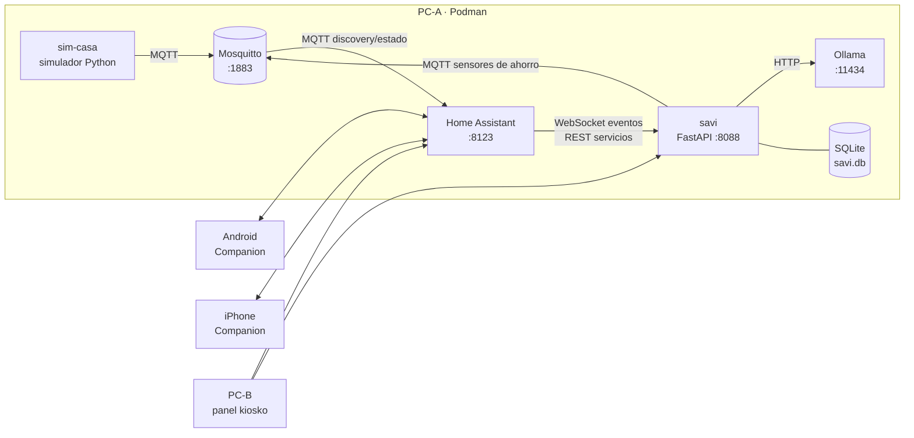

# 02 · Arquitectura

## Hardware y roles

| Equipo | Rol | Qué corre |
|---|---|---|
| **PC-A** (Linux, 16 GB RAM) | Servidor de la casa | Todos los contenedores |
| **PC-B** | Panel de pared + consola del presentador | Navegador en modo kiosko con el dashboard "Yarumo"; terminal SSH a PC-A |
| **Celular Android** | `residente_1` | App Home Assistant Companion |
| **iPhone** | `residente_2` | App Home Assistant Companion |

Todos en la misma red Wi-Fi de la casa. PC-A con IP fija (reserva DHCP en el router o IP estática). En este documento: `192.168.1.50` como ejemplo; se configura en `.env`.

## Diagrama



## Servicios

| Servicio | Imagen / origen | Puerto | Red | Memoria aprox. |
|---|---|---|---|---|
| `homeassistant` | `ghcr.io/home-assistant/home-assistant:stable` | 8123 | host | 0,5–1 GB |
| `mosquitto` | `docker.io/library/eclipse-mosquitto:2` | 1883 | host | < 50 MB |
| `ollama` | `docker.io/ollama/ollama:latest` | 11434 (solo localhost) | host | 3–5 GB con modelo cargado |
| `sim-casa` | build `services/sim-casa` | 8090 (API de escenarios) | host | < 100 MB |
| `savi` | build `services/savi` | 8088 | host | < 200 MB |

Total esperado: ~6–7 GB en uso, deja margen en 16 GB.

**Por qué red `host` para todo:** Home Assistant necesita estar en la red local para que las apps Companion lo encuentren y para mDNS; poner el resto también en `host` evita traducir puertos y nombres entre redes. Es una decisión de demo, no de producción (en producción va en VLAN de IoT; Bloque 1).

## Modelo de lenguaje

- Por defecto: `llama3.2:3b` (~2 GB), elegido en H4 tras medir en PC-A; ver la comparación y la guardia de cifras en `docs/05-savi-ia.md` §6.
- Configurable con `OLLAMA_MODEL`. Se descarga una vez con internet (`podman exec ollama ollama pull llama3.2:3b`) y luego funciona sin conexión.
- Presupuesto de latencia: respuesta de chat < 10 s en CPU. Si no se cumple, bajar de modelo antes de optimizar otra cosa.
- Verificar al iniciar el hito H4 qué modelo da mejor español en ese equipo; dejar la elección escrita en `docs/05-savi-ia.md`.

## Esqueleto de `compose.yaml`

```yaml
name: yarumo
services:
  mosquitto:
    image: docker.io/library/eclipse-mosquitto:2
    network_mode: host
    volumes:
      - ./config/mosquitto:/mosquitto/config:Z
      - mosquitto-data:/mosquitto/data
    restart: unless-stopped

  homeassistant:
    image: ghcr.io/home-assistant/home-assistant:stable
    network_mode: host
    environment:
      - TZ=America/Bogota
    volumes:
      - ./config/homeassistant:/config:Z
    restart: unless-stopped
    depends_on: [mosquitto]

  ollama:
    image: docker.io/ollama/ollama:latest
    network_mode: host
    environment:
      - OLLAMA_HOST=127.0.0.1:11434
    volumes:
      - ollama-data:/root/.ollama
    restart: unless-stopped

  sim-casa:
    build: ./services/sim-casa
    network_mode: host
    env_file: .env
    restart: unless-stopped
    depends_on: [mosquitto]

  savi:
    build: ./services/savi
    network_mode: host
    env_file: .env
    volumes:
      - savi-data:/data
    restart: unless-stopped
    depends_on: [homeassistant, mosquitto, ollama]

volumes:
  mosquitto-data:
  ollama-data:
  savi-data:
```

## Variables de entorno (`.env.example`)

```dotenv
TZ=America/Bogota
HOST_IP=192.168.1.50

MQTT_HOST=127.0.0.1
MQTT_PORT=1883
MQTT_USER=yarumo
MQTT_PASSWORD=cambiar

HA_URL=http://127.0.0.1:8123
HA_TOKEN=pegar_token_de_larga_duracion

OLLAMA_URL=http://127.0.0.1:11434
OLLAMA_MODEL=llama3.2:3b

# Tarifa de energía en COP/kWh. Tomar el valor de una factura real de EPM.
TARIFA_COP_KWH=0
TARIFA_VERIFICADA=false

SAVI_PORT=8088
SIM_PORT=8090
DEMO_MODE=true
```

## Estructura del repo

```
yarumo-demo/
├─ CLAUDE.md
├─ compose.yaml
├─ .env.example
├─ config/
│  ├─ mosquitto/mosquitto.conf, passwd
│  └─ homeassistant/  (configuration.yaml, packages/, dashboards/)
├─ services/
│  ├─ sim-casa/  (pyproject.toml, Containerfile, src/sim_casa/, tests/)
│  └─ savi/      (pyproject.toml, Containerfile, src/savi/, tests/)
├─ scripts/  (seed-history.sh, demo-reset.sh, check-stack.sh)
└─ docs/
```

## Seguridad mínima

- Mosquitto con usuario y contraseña (`allow_anonymous false`).
- Token de larga duración de HA solo en `.env`.
- Ollama escucha solo en `127.0.0.1`.
- Firewall de PC-A: abrir solo 8123/tcp y 8088/tcp a la red local (`firewalld` en Fedora, `ufw` en Ubuntu).
- Nada expuesto a internet.

## Dependencia de internet (conocida y declarada)

| Función | ¿Necesita internet? |
|---|---|
| Simulador, HA, automatizaciones, Savi, chat con LLM | No |
| Apps Companion en la misma Wi-Fi (dashboard, presencia por Wi-Fi) | No |
| **Notificaciones push a los celulares** | **Sí** (pasan por el servicio de push de HA y Google/Apple) |
| Descargar imágenes y el modelo | Sí, solo la primera vez |

En la prueba "sin internet" del guion, el aviso de Savi se ve en el panel y como notificación persistente de HA, no como push.
